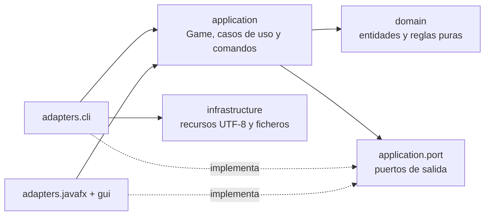

# Risk — USC Programación Orientada a Objetos

Implementación académica completa de Risk de Diego Barreiro Pérez y Miguel
Bugarín Carreira. Conserva las reglas, comandos, mapa, recursos y aspecto JavaFX
del proyecto original, con una construcción reproducible sobre Java 21, pruebas
JUnit 5, análisis estático, Docker e integración continua.


La demostración histórica de la interfaz está disponible
[aquí](https://kodul.ar/lS3zBD). El PDF y la captura originales se conservan como
referencia de identidad visual.

## Requisitos

- JDK Eclipse Temurin u otro OpenJDK 21.
- Maven 3.9.11 o compatible.
- Docker 29 y Docker Compose v2, solo para los flujos en contenedor.
- Escritorio con servidor gráfico para JavaFX.

Todo el proyecto, las pruebas y los escenarios trabajan en UTF-8. No es necesario
descargar JAR manualmente: Maven resuelve JavaFX 21.0.8 y JFoenix.

## Inicio rápido nativo

Verificación completa:

```shell
mvn clean verify
```

Ejecución del escenario CLI canónico incluido en `src/main/resources`:

```shell
mvn -DskipTests package
java -jar target/risk-2.0.0-SNAPSHOT-all.jar
```

La consola procesa `comandos.csv`, muestra la transcripción y escribe
`resultados.txt`. Para usar recursos externos:

```shell
java -Drisk.resources.dir=mi-escenario -Drisk.scenario=comandos.csv \
  -Drisk.output.dir=salida -jar target/risk-2.0.0-SNAPSHOT-all.jar
```

Ejecución de la interfaz JavaFX:

```shell
mvn javafx:run
```

## Inicio rápido con Docker

```shell
docker build --target runtime --tag usc-risk:local .
docker compose run --rm cli
docker compose run --rm test
docker compose up --build gui
```

El servicio `cli` ejecuta el escenario determinista como usuario no privilegiado
y deja `resultados.txt` en `docker-output/`. El servicio `test` ejecuta desde cero
`mvn clean verify` en Linux. El servicio `gui` publica la misma interfaz JavaFX
mediante Xvfb, x11vnc y noVNC. Una vez iniciado, se abre en:

<http://localhost:6080/?autoconnect=true&resize=scale>

No requiere plugins del navegador. El contenedor ejecuta tanto JavaFX como el
servidor gráfico con un usuario no privilegiado; el puerto VNC interno no se
publica, únicamente el cliente web noVNC. Para detenerlo:

```shell
docker compose down
```

Si el puerto 6080 está ocupado, puede elegirse otro sin modificar archivos:

```shell
RISK_GUI_PORT=6083 docker compose up --build gui
```

El enlace se limita deliberadamente a `127.0.0.1`. Para una publicación en
Internet debe colocarse detrás de un proxy HTTPS con autenticación; noVNC no se
expone sin protección desde este proyecto.

## Arquitectura



- `domain`: mapa, países, continentes, fronteras, jugadores, cartas, ejércitos,
  misiones y abstracción inyectable de dados. No importa JavaFX, consola ni I/O.
- `application`: una instancia `Game` por partida, contexto de ejecución acotado,
  registro tipado de comandos y evaluación de victoria.
- `adapters.cli`: punto de entrada de consola y presentación textual.
- `adapters.javafx` y `gui`: punto de entrada y vistas/controladores FXML. Invocan
  los mismos comandos y casos de uso que la CLI.
- `infrastructure.resources`: lectura de classpath o directorios externos y salida
  reproducible en UTF-8.
- `comandos`, `jugar` y `salida`: fachada de compatibilidad de los comandos
  públicos originales mientras delegan en la partida y puertos modernos.

Cada `Game` contiene su propio mapa, jugadores, cola de turnos, cartas, registro,
salida y transcripción. `GameContext` solo transporta temporalmente la instancia
activa y la restaura con `try/finally`; dos partidas pueden ejecutarse en paralelo
sin compartir estado mutable.

## Decisiones de diseño

- Se preservó el modelo original y se refactorizó incrementalmente bajo pruebas de
  caracterización; no se sustituyó por una simulación simplificada.
- La reflexión mediante `Class.newInstance()` fue reemplazada por factorías
  registradas y tipadas.
- La ejecución de comandos es síncrona y no crea pools por comando; la GUI conserva
  el ciclo de vida de JavaFX y sus callbacks se ejecutan en el hilo llamante.
- `DiceRoller` permite inyectar secuencias o semillas deterministas.
- Los builders validan invariantes y lanzan excepciones explícitas; nunca imprimen
  un error para devolver `null`.
- Colecciones expuestas por el dominio son copias inmutables cuando corresponde y
  los objetos de valor implementan conjuntamente `equals` y `hashCode`.
- El orden observable usa colecciones enlazadas y locale/codificación fijados para
  que el gold standard sea idéntico en Windows, Linux y Docker.

La explicación detallada del cambio está en
[`docs/MIGRATION.md`](docs/MIGRATION.md) y la línea base original en
[`docs/BASELINE.md`](docs/BASELINE.md).

## Pruebas y calidad

```shell
mvn test
mvn verify
```

`verify` ejecuta JUnit 5, JaCoCo, Checkstyle, Spotless, SpotBugs y compilación con
`-Xlint:all -Werror`. El informe navegable queda en
`target/site/jacoco/index.html`. Los umbrales obligatorios para `domain` y
`application` son 80 % de líneas y 70 % de ramas; la última verificación local
alcanza **87,15 % de líneas (739/848) y 81,09 % de ramas (283/349)**.

La suite cubre entidades del dominio, dados, cartas, misiones, asignación y turnos,
ataques, conquista, rearme, canje, condiciones de victoria, errores, parser,
registro tipado, aislamiento y concurrencia de partidas. La integración ejecuta
las 110 órdenes de `comandos.csv` y compara exactamente la salida con el
`goldstandard.txt` canónico. Una prueba adicional valida que el FXML principal y
sus recursos estén empaquetados y sean XML seguro y bien formado.

## Añadir funcionalidad

### Nuevo comando

1. Añadir su patrón y estado a `Comandos`.
2. Implementar `IComando` y anotar la clase con `@Comando`.
3. Registrar su factoría en `CommandRegistry`.
4. Añadir pruebas del patrón, estado permitido, salida y códigos de error.

### Nueva carta

1. Añadir el subtipo a `SubEquipamientos` con su tipo y valor.
2. Implementar la especialización de `Carta` solo si aporta comportamiento.
3. Incorporarla al mazo creado por el mapa y probar nombre, rearme y canje.

### Nuevo ejército

1. Extender la jerarquía correspondiente únicamente si cambia ataque o defensa.
2. Asociarlo al color en `Ejercito.Builder`.
3. Probar transferencias, límites y el polimorfismo específico del color.

## Integración continua

`.github/workflows/ci.yml` ejecuta `mvn clean verify` en Ubuntu 24.04 y Windows
2025, publica el informe JaCoCo, construye las imágenes CLI y GUI, ejecuta ambos
smoke tests y verifica el servicio Docker de pruebas.

## Limitaciones conocidas

- JFoenix 9.0.10 se mantiene para preservar la identidad de la GUI original. Sus
  iconos obsoletos se sustituyeron por glifos Unicode compatibles con JavaFX 21.
- La CI comprueba que JavaFX y noVNC arrancan y que el cliente web responde, pero no
  automatiza partidas completas mediante interacción gráfica.
- El editor experimental de mapas del proyecto original continúa deshabilitado en
  la navegación, tal como estaba en la línea base; el juego, CLI y GUI principal se
  conservan.

## Licencia

El proyecto mantiene la licencia existente [The Unlicense](LICENSE), reconocible
por GitHub mediante el archivo `LICENSE` de la raíz.
